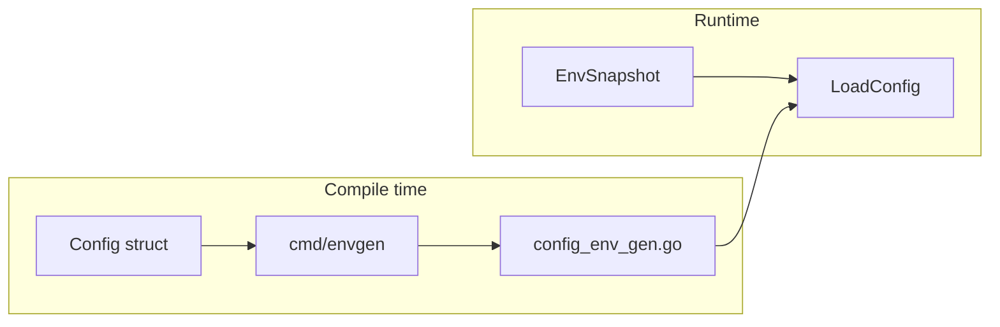

# env

**Blazing-fast, zero-allocation environment configuration for Go.**

`github.com/gopherust-io/env` parses environment variables into typed structs using compile-time code generation. No reflection at runtime. No external dependencies in your binary. One `os.Environ()` pass, then direct field assignment.

```text
  caarlos0/env   11,619 ns/op   220 allocs
  viper           3,146 ns/op    70 allocs
  stdlib            150 ns/op     0 allocs
  env                  74 ns/op     0 allocs   ← you are here
```

---

## Why env?

Most Go config libraries parse env vars with reflection on every startup. That costs CPU, heap allocations, and GC pressure — especially in services with large configs or tight cold-start budgets.

| Approach | Startup cost | Maintenance |
|----------|--------------|-------------|
| Hand-written `os.Getenv` | Fast, zero alloc | Verbose, easy to break |
| Reflection (`caarlos0/env`, `viper`, …) | Slow, many allocs | Convenient tags |
| **env (codegen)** | **Fast, zero alloc** | **Tags + `go generate`** |

You keep the ergonomics of struct tags. The generator emits a loader tailored to your config — the compiler inlines primitive parsers, and the runtime never touches `reflect`.

---

## How it works



1. Define a struct with `env` tags.
2. Run `go generate` — `envgen` emits `LoadConfig`, `MustLoadConfig`, and optionally `Masked()`.
3. At startup, call `LoadConfig()`. One environment snapshot, zero reflection, all errors collected in a single pass.

---

## Install

```bash
go get github.com/gopherust-io/env
```

**Zero runtime dependencies.** The library uses only the Go standard library. Competitor libraries are isolated in a separate [`bench/`](bench/) module and never end up in your `go.mod`.

---

## Quick start

**1. Config struct**

```go
package config

import "time"

//go:generate go run github.com/gopherust-io/env/cmd/envgen -type Config -output config_env_gen.go

type Database struct {
    Host     string `env:"HOST" required`
    Port     int    `env:"PORT" default:"5432"`
    Password string `env:"PASSWORD" sensitive`
}

type Config struct {
    Port    int               `env:"PORT" default:"8080"`
    Debug   bool              `env:"DEBUG"`
    Timeout time.Duration     `env:"TIMEOUT" default:"10s"`
    DB      Database          `prefix:"DB_"`
    Tags    []string          `env:"TAGS" sep:","`
    Labels  map[string]string `env:"LABELS" sep:"," kvsep:":"`
}
```

**2. Generate**

```bash
go generate ./...
```

**3. Load**

```go
cfg, err := config.LoadConfig()
if err != nil {
    log.Fatal(err)
}

log.Printf("config: %+v", cfg.Masked()) // secrets redacted
```

---

## Struct tags

| Tag | Description |
|-----|-------------|
| `env:"KEY"` | Environment variable name |
| `default:"..."` | Value when unset |
| `required` | Error if unset and no default |
| `prefix:"FOO_"` | Prefix for nested struct fields |
| `sep:","` | Slice separator (default `,`) |
| `kvsep:":"` | Map key/value separator (default `:`) |
| `sensitive` | Redact in `Masked()` |
| `env:"-"` | Skip field |

Nested prefixes compose: `prefix:"DB_"` + `env:"HOST"` → `DB_HOST`.

---

## Generated API

For a struct named `Config`, envgen generates:

| Function | Description |
|----------|-------------|
| `LoadConfig()` | Parse env into `Config`, return all errors |
| `MustLoadConfig()` | Same, but panics on error |
| `(Config) Masked()` | Copy with `sensitive` fields replaced by `***` |

Errors are aggregated — one failed parse does not hide other problems:

```text
env: DB.Host (DB_HOST): required; Port (PORT): parse: strconv.Atoi: parsing "abc": invalid syntax
```

---

## Performance

Benchmarks compare **stdlib**, **caarlos0/env**, **cleanenv**, **goenv**, **envconfig**, **viper**, and **env** on identical configs.

Run locally:

```bash
make bench
```

Run without cloning (after release):

```bash
go test -bench=. -benchmem -count=1 github.com/gopherust-io/env/bench@latest
```

Results on **darwin/arm64, Apple M4 Pro**:

### Small — 10 fields

| Library | ns/op | allocs | vs env |
|---------|------:|-------:|-------:|
| **env** | **74** | **0** | 1× |
| stdlib | 150 | 0 | 2× slower |
| cleanenv | 2,818 | 57 | 38× |
| viper | 3,146 | 70 | 43× |
| goenv | 5,402 | 8 | 73× |
| caarlos0/env | 11,619 | 220 | **157×** |

### Medium — 50 fields

| Library | ns/op | allocs | vs env |
|---------|------:|-------:|-------:|
| **env** | **398** | **0** | 1× |
| stdlib | 695 | 0 | 1.7× |
| viper | 10,085 | 236 | 25× |
| goenv | 7,501 | 6 | 19× |
| caarlos0/env | 18,373 | 298 | **46×** |

### Large — 100 fields

| Library | ns/op | allocs | vs env |
|---------|------:|-------:|-------:|
| **env** | **946** | **0** | 1× |
| stdlib | 1,509 | 0 | 1.6× |
| goenv | 10,431 | 6 | 11× |
| viper | 18,724 | 439 | 20× |
| caarlos0/env | 26,236 | 410 | **28×** |

env stays at **0 allocations** across all sizes. Reflection-based libraries allocate hundreds of times per parse.

---

## Migration from caarlos0/env

Not a drop-in replacement, but the mapping is simple:

| caarlos0/env | env |
|--------------|-----|
| `env.Parse(&cfg)` | `cfg, err := LoadConfig()` |
| `envDefault:"8080"` | `default:"8080"` |
| `envPrefix:"DB_"` | `prefix:"DB_"` on nested struct |
| `env:"HOST,required"` | `env:"HOST" required` |

<details>
<summary>Before / after example</summary>

```go
// Before
var cfg Config
if err := env.Parse(&cfg); err != nil { ... }

// After
//go:generate go run github.com/gopherust-io/env/cmd/envgen -type Config
cfg, err := LoadConfig()
if err != nil { ... }
```

</details>

---

## Custom types

Implement `env.Unmarshaler` on a pointer receiver:

```go
type Mode string

func (m *Mode) UnmarshalEnv(key, value string) error {
    switch value {
    case "dev", "staging", "prod":
        *m = Mode(value)
        return nil
    default:
        return fmt.Errorf("unknown mode %q", value)
    }
}
```

envgen detects the method and emits a call automatically.

---

## Runtime primitives

Generated loaders use these internally; you can call them directly:

```go
snap := env.Snapshot()

env.ParseInt("8080")
env.ParseDuration("10s")
env.ParseStringSlice("a,b,c", ",")
env.ParseStringMap("k1:v1,k2:v2", ",", ":")
```

---

## License

MIT — see [LICENSE](LICENSE).
