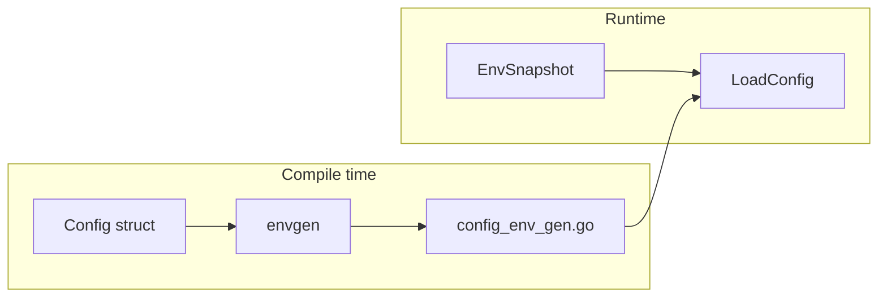

# env

[](https://github.com/gopherust-io/env/actions/workflows/ci.yml)
[](https://pkg.go.dev/github.com/gopherust-io/env)
[](https://goreportcard.com/report/github.com/gopherust-io/env)
[](LICENSE)

**Blazing-fast, zero-allocation environment configuration for Go.**

`github.com/gopherust-io/env` parses environment variables into typed structs using compile-time code generation. No reflection at runtime. No external dependencies. One `os.Environ()` pass, then direct field assignment.

```text
  caarlos0/env   11,619 ns/op   220 allocs
  viper           3,146 ns/op    70 allocs
  stdlib            150 ns/op     0 allocs
  env                  74 ns/op     0 allocs
```

**New here?** → [docs/GETTING_STARTED.md](docs/GETTING_STARTED.md) (copy-paste guide, CI, troubleshooting)

---

## Start in 3 steps

**1. Install**

```bash
go get github.com/gopherust-io/env@latest
go install github.com/gopherust-io/env/cmd/envgen@latest
```

**2. Struct + generate**

```go
package config

//go:generate envgen -type Config -output config_env_gen.go

type Config struct {
    Port  int    `env:"PORT" default:"8080"`
    Debug bool   `env:"DEBUG"`
    Host  string `env:"HOST" default:"localhost"`
}
```

```bash
go generate ./...
# or: envgen -type Config
# list structs: envgen -list
```

**3. Load**

```go
cfg, err := config.LoadConfig()
if err != nil {
    log.Fatal(err)
}
log.Printf("%+v", cfg.Masked()) // safe if you use sensitive:"true"
```

Optional local `.env`: `_ = env.LoadDotEnv(".env")` before `LoadConfig()`.

Full-featured example: [examples/basic](examples/basic/). Minimal: [examples/minimal](examples/minimal/).

---

## Cheatsheet

| I want to… | Do this |
|------------|---------|
| List struct names | `envgen -list` |
| Regenerate loaders | `go generate ./...` |
| Load config | `LoadConfig()` |
| Reload after env change | `ReloadConfig(&cfg)` |
| Log without secrets | `cfg.Masked()` |
| Skip codegen (dev only) | `reflectenv.Parse(&cfg)` |
| Nested fields | `` DB Database `prefix:"DB_"` `` |
| `${VAR}` in values | `` `expand:"true"` `` on field |

---

## How it works



1. Define a struct with `env` tags.
2. `go generate` runs `envgen` → `LoadConfig`, `ReloadConfig`, `Masked()`.
3. `LoadConfig()` indexes the environment once and assigns fields with zero reflection.

---

## Struct tags

| Tag | Description |
|-----|-------------|
| `env:"KEY"` | Environment variable name |
| `default:"..."` | Value when unset |
| `required:"true"` | Error if unset and no default |
| `prefix:"FOO_"` | Prefix for nested struct fields |
| `sep:","` | Slice separator (default `,`) |
| `kvsep:":"` | Map key/value separator (default `:`) |
| `layout:"..."` | `time.Time` parse layout (default RFC3339) |
| `expand:"true"` | Expand `${VAR}` and `$VAR` in values |
| `sensitive:"true"` | Redact in `Masked()` |
| `env:"-"` | Skip field |

Nested prefixes compose: `prefix:"DB_"` + `env:"HOST"` → `DB_HOST`.

---

## Generated API

| Function | Description |
|----------|-------------|
| `LoadConfig()` | Parse env into `Config` |
| `ReloadConfig(cfg *Config)` | Re-parse env in-place |
| `LoadConfigFrom(snap)` | Parse from a custom snapshot |
| `MustLoadConfig()` | Panics on error |
| `(Config) Masked()` | Copy with sensitive fields redacted |

Errors are collected in one pass:

```text
env: DB.Host (DB_HOST): required; Port (PORT): parse: strconv.Atoi: parsing "abc": invalid syntax
```

---

## Local development (.env)

```go
_ = env.LoadDotEnv(".env")
cfg, err := config.LoadConfig()
```

`LoadDotEnv` fills unset variables from a file and refreshes the snapshot. Existing process variables are preserved.

Read-only merge without touching `os.Environ()`:

```go
snap, err := env.SnapshotWithDotEnv(".env")
cfg, err := config.LoadConfigFrom(snap)
```

---

## Variable expansion

```go
BaseURL string `env:"BASE_URL" default:"${NATS_URL}/api" expand:"true"`
```

Supports `${VAR}` and `$VAR` syntax.

---

## Hot reload

```go
cfg, _ := config.LoadConfig()
os.Setenv("PORT", "9090")
_ = config.ReloadConfig(&cfg)
```

---

## Cross-package nested structs

```go
import "myapp/internal/db"

type Config struct {
    DB db.Database `prefix:"DB_"`
}
```

---

## Reflection fallback (opt-in)

```go
import "github.com/gopherust-io/env/reflectenv"

var cfg Config
reflectenv.Parse(&cfg)
```

Slower than codegen — use `envgen` in production.

---

## Custom types

```go
type Mode string

func (m *Mode) UnmarshalEnv(key, value string) error {
    switch value {
    case "dev", "staging", "prod":
        *m = Mode(value)
        return nil
    default:
        return fmt.Errorf("unknown mode %q", value)
    }
}
```

---

## Migration from caarlos0/env

| caarlos0/env | env |
|--------------|-----|
| `env.Parse(&cfg)` | `LoadConfig()` |
| `envDefault:"8080"` | `default:"8080"` |
| `envPrefix:"DB_"` | `prefix:"DB_"` |
| `env:"HOST,required"` | `env:"HOST" required:"true"` |

---

## Performance

```bash
make bench-remote VERSION=v0.4.0
```

| Fixture | env | caarlos0/env | Speedup |
|---------|----:|-------------:|--------:|
| 10 fields | **74 ns**, 0 allocs | 11,619 ns, 220 allocs | **157×** |
| 50 fields | **398 ns**, 0 allocs | 18,373 ns, 298 allocs | **46×** |
| 100 fields | **946 ns**, 0 allocs | 26,236 ns, 410 allocs | **28×** |

---

## Runtime API

```go
snap := env.Snapshot()
snap.Lookup("PORT")
env.ParseInt("8080")
env.LoadDotEnv(".env")
env.Reload()
```

---

## Changelog

See [CHANGELOG.md](CHANGELOG.md).

## License

MIT — see [LICENSE](LICENSE).
